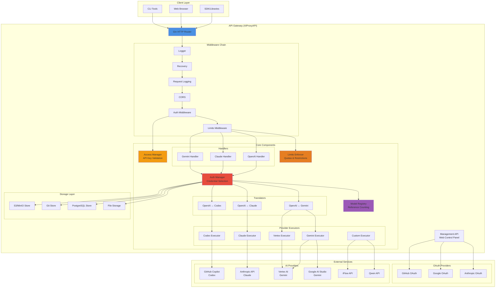
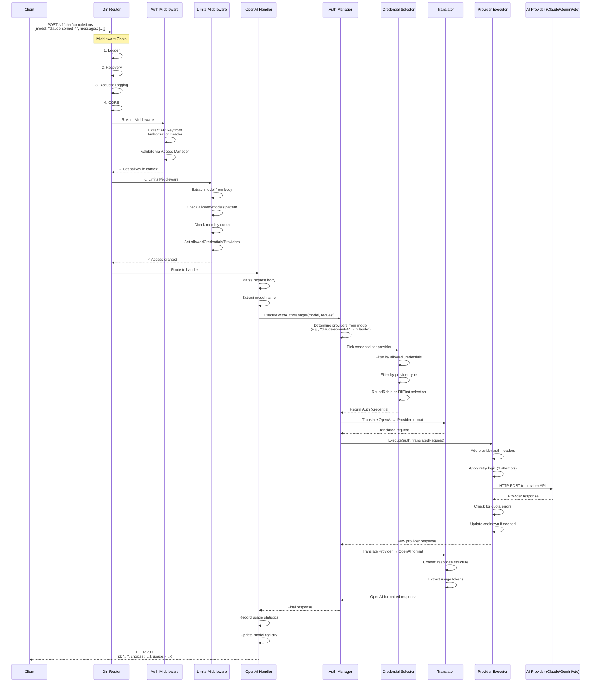
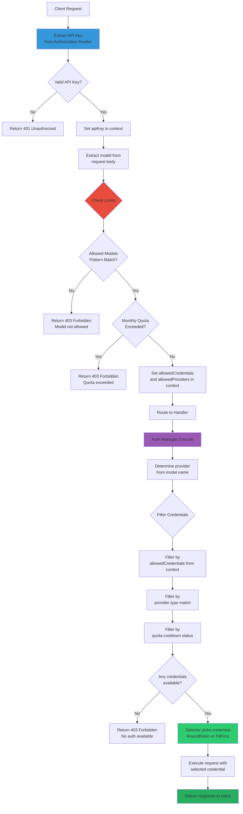
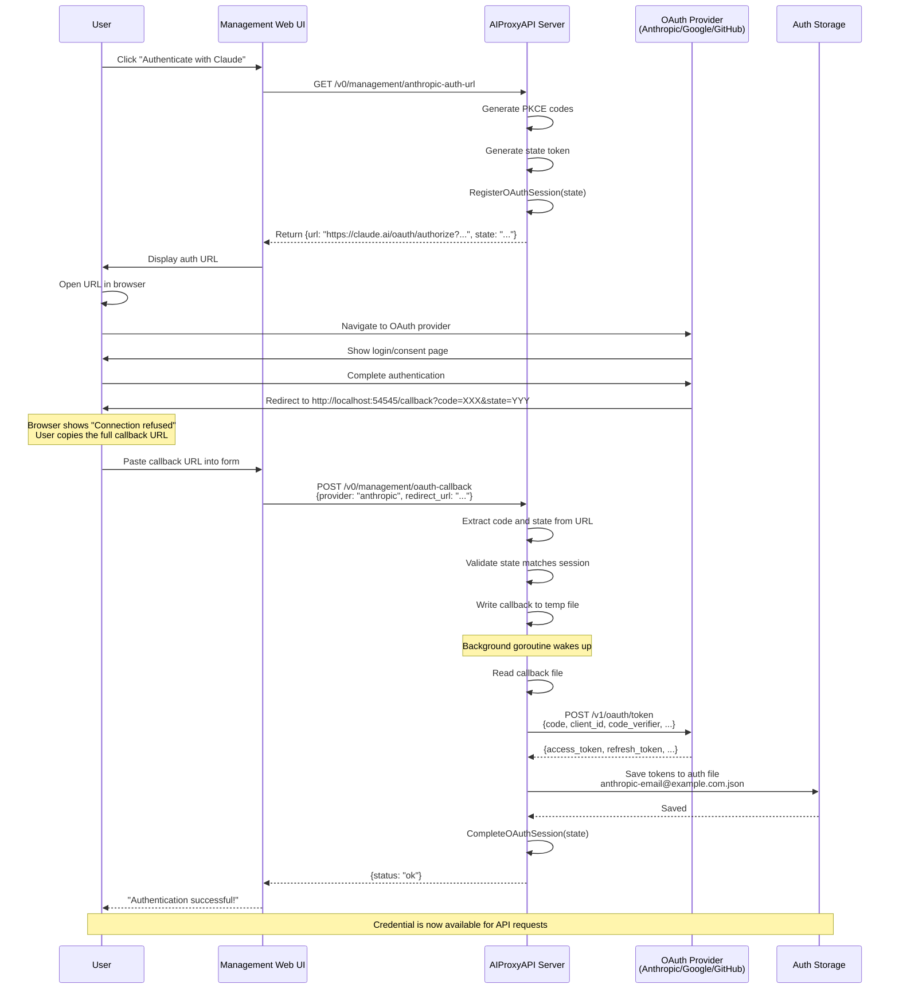
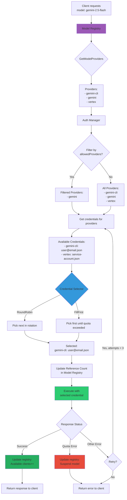

# AIProxyAPI - Complete Architecture Documentation

## 📋 Overview

**AIProxyAPI** is a unified AI gateway proxy that provides a single OpenAI-compatible interface to multiple AI providers (Anthropic Claude, Google Gemini, OpenAI Codex, Qwen, GitHub Copilot, iFlow, etc.).

---

## 🏗️ Architecture Diagrams

### 1. Overall System Architecture



### 2. Request Flow (Client → Response)



### 3. Authentication & Authorization Flow



### 4. OAuth Authentication Flow



### 5. Model Registry & Provider Routing



### 6. Component Relationships

```mermaid
graph LR
    subgraph "HTTP Layer"
        Router[Gin Router]
        Middleware[Middleware Chain]
    end

    subgraph "Access Control"
        AccessMgr[Access Manager]
        Limits[Limits Enforcer]
    end

    subgraph "Request Processing"
        Handlers[API Handlers]
        BaseHandler[Base Handler]
    end

    subgraph "Credential Management"
        AuthMgr[Auth Manager]
        Selector[Credential Selector]
        Auths[(Auth Entries)]
    end

    subgraph "Model Management"
        Registry[Model Registry]
        Models[(Model Definitions)]
    end

    subgraph "Protocol Translation"
        Translators[Translators]
        OpenAIFmt[OpenAI Format]
        ClaudeFmt[Claude Format]
        GeminiFmt[Gemini Format]
    end

    subgraph "Execution"
        Executors[Provider Executors]
        HTTPClient[HTTP Client]
    end

    subgraph "Storage"
        Storage[Storage Interface]
        FileStore[File Store]
        PostgresStore[Postgres Store]
        GitStore[Git Store]
        S3Store[S3 Store]
    end

    Router --> Middleware
    Middleware --> AccessMgr
    Middleware --> Limits
    Middleware --> Handlers

    Handlers --> BaseHandler
    BaseHandler --> AuthMgr
    BaseHandler --> Registry

    AuthMgr --> Selector
    AuthMgr --> Auths
    AuthMgr --> Translators

    Selector --> Auths
    Selector --> Registry

    Registry --> Models

    Translators --> OpenAIFmt
    Translators --> ClaudeFmt
    Translators --> GeminiFmt

    AuthMgr --> Executors
    Executors --> HTTPClient

    Auths --> Storage
    Storage --> FileStore
    Storage --> PostgresStore
    Storage --> GitStore
    Storage --> S3Store

    AccessMgr -.validates.-> Limits
    Limits -.restricts.-> AuthMgr

    style Router fill:#4A90E2
    style AuthMgr fill:#E74C3C
    style Registry fill:#9B59B6
    style Translators fill:#2ECC71
    style Storage fill:#F39C12
```

---

## 🛠️ Tech Stack

### **Core Framework**
- **Language**: Go 1.21+
- **HTTP Server**: [Gin](https://github.com/gin-gonic/gin) v1.10.0
- **Logging**: [Logrus](https://github.com/sirupsen/logrus) v1.9.3

### **Authentication & Security**
- **OAuth 2.0**: Custom implementation with PKCE
- **JWT**: [golang-jwt/jwt](https://github.com/golang-jwt/jwt) v5.2.1
- **Password Hashing**: [bcrypt](https://pkg.go.dev/golang.org/x/crypto/bcrypt)
- **Session Management**: In-memory with state tokens

### **Storage**
- **File System**: Native Go file I/O
- **PostgreSQL**: [pgx](https://github.com/jackc/pgx) v5.7.1
- **Git**: [go-git](https://github.com/go-git/go-git) v5.12.0
- **S3/MinIO**: [minio-go](https://github.com/minio/minio-go) v7.0.77

### **HTTP & Networking**
- **HTTP Client**: `net/http` with retry logic
- **WebSocket**: [gorilla/websocket](https://github.com/gorilla/websocket) v1.5.3
- **CORS**: [gin-contrib/cors](https://github.com/gin-contrib/cors) v1.7.2
- **Proxy**: SOCKS5 support via [golang.org/x/net/proxy](https://pkg.go.dev/golang.org/x/net/proxy)

### **Configuration**
- **YAML**: [gopkg.in/yaml.v3](https://gopkg.in/yaml.v3)
- **File Watching**: [fsnotify](https://github.com/fsnotify/fsnotify) v1.7.0
- **Hot Reload**: Custom watcher implementation

### **AI Provider SDKs**
- **Google Gemini**: [google.golang.org/api/aiplatform](https://pkg.go.dev/google.golang.org/api/aiplatform)
- **Anthropic**: Custom HTTP client
- **OpenAI**: Custom HTTP client (OpenAI-compatible format)

### **Testing**
- **Framework**: Go standard `testing` package
- **HTTP Testing**: `httptest`
- **Assertions**: Table-driven tests

### **Build & Deployment**
- **Build**: Native Go toolchain
- **Containerization**: Docker support
- **Process Management**: Systemd, Supervisor, or native

### **Frontend (Management UI)**
- **Framework**: Vanilla JavaScript (ES6+)
- **Styling**: Custom CSS
- **Build**: No build step required
- **Hosting**: Embedded in Go binary or CDN

---

## 📊 How It Handles Requests (Detailed)

### **1. API Key Validation**
- Extract `Authorization: Bearer <key>` header
- Lookup in `config.api-keys` array
- Support bcrypt-hashed keys for security
- Store validated key in Gin context

### **2. Request Limits Enforcement**
- Extract model name from JSON body
- Pattern match against `api-key-limits.allowed-models` (wildcards supported)
- Check monthly quota: `api-key-limits.monthly-quotas`
- If exceeded: Return 403 with quota info
- Set `allowedCredentials` and `allowedProviders` in context for downstream filtering

### **3. Model Resolution**
- Parse model name (e.g., `claude-sonnet-4-20250514`)
- Extract provider (e.g., `claude`)
- Query Model Registry for available providers
- Filter by `allowedProviders` from limits context

### **4. Credential Selection**
- Get all credentials for matching providers
- Filter by `allowedCredentials` from limits context
- Filter out quota-exceeded credentials (cooldown)
- Apply selection strategy:
  - **RoundRobin**: Distribute requests evenly
  - **FillFirst**: Use first credential until quota, then next

### **5. Protocol Translation**
- **OpenAI → Gemini**: Convert to `contents`, `parts`, `generationConfig`
- **OpenAI → Claude**: Convert to `messages`, `max_tokens`, `system`
- **Response reverse**: Convert back to OpenAI format with `choices`, `usage`

### **6. Request Execution**
- Build HTTP request with provider-specific headers
- Apply credential authentication (OAuth token, API key, service account)
- Execute with retry logic (3 attempts, exponential backoff)
- Handle quota errors with cooldown (suspend for 60 seconds)

### **7. Usage Tracking**
- Count tokens from response `usage` field
- Update `usage-statistics.json` with:
  - API key
  - Model name
  - Request count
  - Month/year
- Periodic flush to disk (every 5 minutes)

### **8. Error Handling**
- **401 Unauthorized**: Invalid API key
- **403 Forbidden**: Quota exceeded or model not allowed
- **404 Not Found**: Model not available
- **429 Too Many Requests**: Provider rate limit
- **500 Internal Server Error**: Execution failure
- **503 Service Unavailable**: No credentials available

### **9. Response Streaming**
- Detect `stream: true` in request
- Use chunked transfer encoding
- Send SSE events: `data: {...}\n\n`
- Flush after each chunk
- Send `data: [DONE]\n\n` at end

---

## 🔑 Key Features

✅ **Multi-Provider Support**: Claude, Gemini, Codex, Qwen, Copilot, iFlow, Vertex
✅ **OpenAI-Compatible API**: Drop-in replacement for OpenAI API
✅ **OAuth Authentication**: Automatic token refresh for all providers
✅ **Credential Management**: File/PostgreSQL/Git/S3 storage
✅ **API Key Limits**: Per-key model restrictions and monthly quotas
✅ **Load Balancing**: RoundRobin and FillFirst strategies
✅ **Hot Reload**: Configuration changes without restart
✅ **Protocol Translation**: Automatic format conversion
✅ **Usage Tracking**: Detailed statistics and quota enforcement
✅ **Management UI**: Web-based control panel
✅ **Streaming Support**: Server-Sent Events for real-time responses
✅ **Retry Logic**: Automatic retry with exponential backoff
✅ **Quota Cooldown**: Automatic credential rotation on quota errors

---

## 📝 Summary

AIProxyAPI is a production-grade AI API gateway that:
- Provides a unified OpenAI-compatible interface to 7+ AI providers
- Handles authentication, quota management, and protocol translation
- Supports multiple storage backends and credential types
- Offers fine-grained access control with API key limits
- Includes hot reload, usage tracking, and comprehensive management UI
- Built with Go for performance and reliability
- Designed for self-hosting with minimal dependencies

**Perfect for:**
- Organizations using multiple AI providers
- Teams wanting centralized quota management
- Developers building AI applications with OpenAI SDK
- Self-hosted AI gateway deployments
